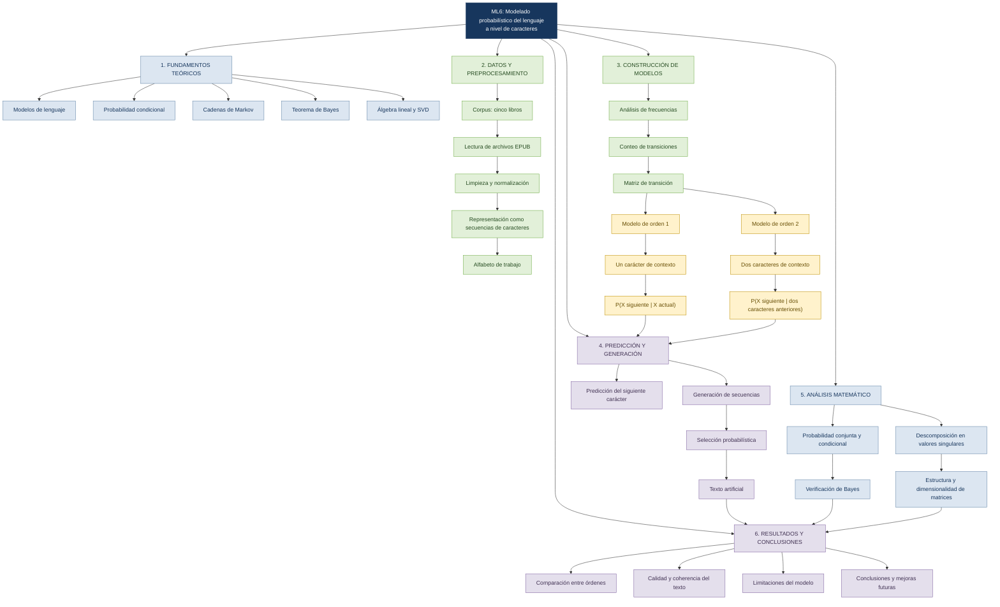

```mermaid
flowchart TD
    A["ML6: Modelado probabilístico del lenguaje<br/>a nivel de caracteres"]

    A --> B["1. FUNDAMENTOS TEÓRICOS"]
    A --> C["2. DATOS Y PREPROCESAMIENTO"]
    A --> D["3. CONSTRUCCIÓN DE MODELOS"]
    A --> E["4. PREDICCIÓN Y GENERACIÓN"]
    A --> F["5. ANÁLISIS MATEMÁTICO"]
    A --> G["6. RESULTADOS Y CONCLUSIONES"]

    B --> B1["Modelos de lenguaje"]
    B --> B2["Probabilidad condicional"]
    B --> B3["Cadenas de Markov"]
    B --> B4["Teorema de Bayes"]
    B --> B5["Álgebra lineal y SVD"]

    C --> C1["Corpus: cinco libros"]
    C1 --> C2["Lectura de archivos EPUB"]
    C2 --> C3["Limpieza y normalización"]
    C3 --> C4["Representación como secuencias de caracteres"]
    C4 --> C5["Alfabeto de trabajo"]

    D --> D1["Análisis de frecuencias"]
    D1 --> D2["Conteo de transiciones"]
    D2 --> D3["Matriz de transición"]

    D3 --> D4["Modelo de orden 1"]
    D3 --> D5["Modelo de orden 2"]

    D4 --> D4A["Un carácter de contexto"]
    D4A --> D4B["P(X siguiente | X actual)"]

    D5 --> D5A["Dos caracteres de contexto"]
    D5A --> D5B["P(X siguiente | dos caracteres anteriores)"]

    D4B --> E
    D5B --> E

    E --> E1["Predicción del siguiente carácter"]
    E --> E2["Generación de secuencias"]
    E2 --> E3["Selección probabilística"]
    E3 --> E4["Texto artificial"]

    F --> F1["Probabilidad conjunta y condicional"]
    F1 --> F2["Verificación de Bayes"]
    F --> F3["Descomposición en valores singulares"]
    F3 --> F4["Estructura y dimensionalidad de matrices"]

    E4 --> G
    F2 --> G
    F4 --> G
    G --> G1["Comparación entre órdenes"]
    G --> G2["Calidad y coherencia del texto"]
    G --> G3["Limitaciones del modelo"]
    G --> G4["Conclusiones y mejoras futuras"]

    classDef main fill:#17365D,color:#fff,stroke:#17365D
    classDef theory fill:#DCE6F1,color:#17365D,stroke:#6486A8
    classDef process fill:#E2F0D9,color:#254B20,stroke:#70AD47
    classDef model fill:#FFF2CC,color:#664D03,stroke:#BF9000
    classDef result fill:#E4DFEC,color:#403152,stroke:#8064A2

    class A main
    class B,B1,B2,B3,B4,B5,F,F1,F2,F3,F4 theory
    class C,C1,C2,C3,C4,C5,D,D1,D2,D3 process
    class D4,D5,D4A,D4B,D5A,D5B model
    class E,E1,E2,E3,E4,G,G1,G2,G3,G4 result

```